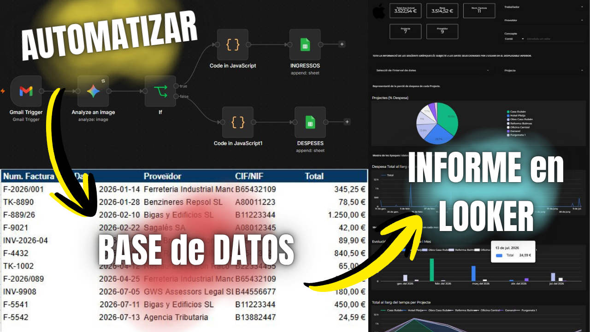
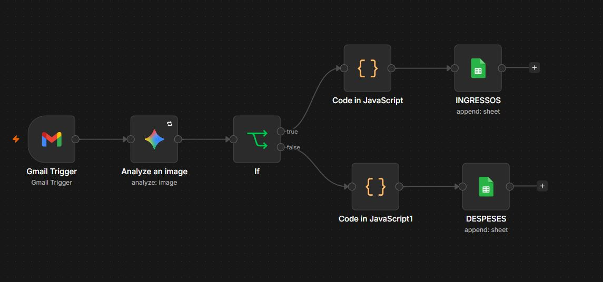
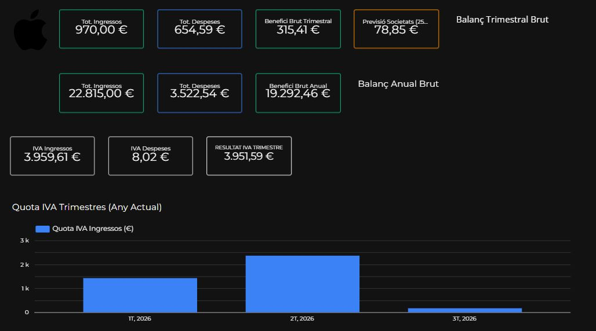
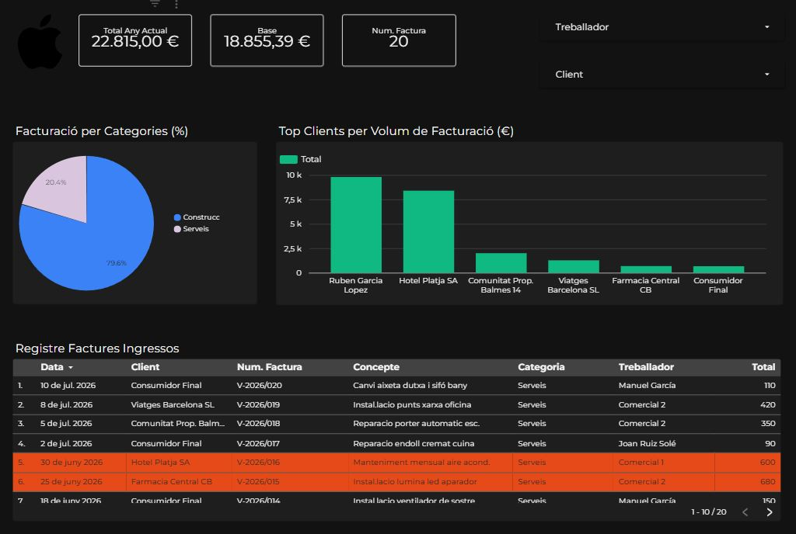

# 📊 Ecosistema Financiero, Fiscal y de BI Automatizado para PYMES y Autónomos

## 🎯 El Factor Diferencial: De la Foto al Informe sin Intervención Humana
Lo que verdaderamente destaca a este ecosistema frente a otros cuadros de mando analíticos tradicionales es que **elimina por completo el trabajo manual de picar datos**. 

Este proyecto está pensado para la realidad diaria de las empresas y los autónomos: el usuario simplemente **saca una foto a su factura de gasto con el móvil o auto-reenvía los correos de ingresos/compras en cualquier formato (PDF, imagen, texto)**. A partir de ahí, la tecnología trabaja sola: el sistema extrae la información, clasifica el tipo de transacción y posiciona cada ingreso y cada gasto en su sitio con precisión matemática, actualizando los informes y los impuestos en tiempo real y sin margen de error humano.

A diferencia de los ERPs tradicionales (que conllevan altos costes de licencia, rigidez y complejas curvas de aprendizaje), esta arquitectura se ha levantado desde cero combinando herramientas en la nube altamente escalables y accesibles: **n8n** (orquestación inteligente), **Google Sheets** (almacenamiento relacional) y **Google Looker Studio** (visualización ejecutiva y fiscal).

---

## 🔗 Demo Interactiva
👉 **[Ver el Dashboard Interactivo en Vivo (Looker Studio)](https://datastudio.google.com/reporting/136a952a-a515-4dc3-b1b4-024aaa6130a5)**

*(Nota: Para garantizar la integridad de la aplicación y la privacidad de los datos, la demostración funciona en un entorno seguro de solo lectura cargado con datos anonimizados de muestra).*

---

## 🏗️ Arquitectura del Sistema (End-to-End)

El ecosistema opera bajo una arquitectura modular de tres capas desacopladas, lo que garantiza un procesamiento fluido desde la captura de la factura hasta la decisión directiva en cuestión de segundos:

### 1. Capa de Ingesta Inteligente y Lógica (`n8n`)
El backend reemplaza a la clásica administrativa digital mediante un flujo de nodos orquestados en **n8n**:
- **Recepción Multicanal (Trigger):** Captura inmediata de documentos a través de correos reenviados, subidas de archivos, webhooks o formularios.
- **Extracción, Limpieza y Sanitización:** Los bloques lógicos analizan el contenido del documento, identifican metadatos clave (CIF/NIF, Cliente/Proveedor, Concepto), aíslan la base imponible y calculan automáticamente la cuota y porcentaje de IVA vigente según la tipología fiscal.
- **Enrutamiento Condicional Autónomo:** El algoritmo clasifica si el documento representa una entrada de capital o una salida, y lo inyecta directamente mediante API en la tabla contable correspondiente (Ingresos o Gastos).

*Vista de la arquitectura lógica en n8n: desde la recepción y clasificación automática hasta la inserción en base de datos sin error.*

---

### 2. Capa de Almacenamiento Relacional en la Nube (`Google Sheets`)
Actúa como un almacén de datos estructurado y ligero en la nube. Para evitar la lentitud y degradación de rendimiento típica de hojas de cálculo saturadas, la base de datos se ha diseñado bajo un modelo relacional normalizado, dividiendo los registros en tablas separadas (`📈 BASE - INGRESSOS` y `📊 BASE - DESPESES`). Estas tablas son alimentadas de manera automática por el flujo de n8n, aunque también pueden introducirse manualmente datos en el 'Google Sheets'.

---

### 3. Capa de Analítica, BI y Previsión Fiscal (`Looker Studio`)
El panel interactivo se ha construido bajo la regla fundamental del Business Intelligence moderno: **"UI/UX Directiva y Cero Mantenimiento"**. No se busca abrumar al usuario con infografías saturadas, sino presentar las métricas financieras e impositivas exactas que un gerente necesita para tomar decisiones rápidas y dormir tranquilo al cierre del trimestre.

*Módulo fiscal automatizado que calcula las cuotas de IVA trimestral y protege el 25% del beneficio bruto como reserva impositiva.*

**Funcionalidades directivas clave:**
- **🏛️ Módulo de Previsión Fiscal Automática:** Cálculo inmediato del IVA trimestral a compensar o pagar (cruce en directo de IVA Repercutido vs. IVA Soportado). Incorpora el KPI directivo del **"Colchón Fiscal"**, un algoritmo que calcula y bloquea visualmente el 25% del Beneficio Neto en una tarjeta de alerta como provisión intocable para liquidar el Impuesto de Sociedades o el IRPF a final de año.
- **🏆 Ránking Pareto de Clientes (Top Tier):** Visualización directiva que identifica al instante y con precisión al grupo reducido de clientes que aportan el grueso del volumen de facturación y rentabilidad real del negocio.
- **📈 Salud Operativa en Tiempo Real:** Seguimiento ininterrumpido del Beneficio Bruto Anual, ingresos totales y gastos acumulados sin necesidad de esperar a cierres contables manuales.

*Ránking interactivo de facturación para detectar a los clientes más rentables al instante, la fracción de facturación por categorías, y el registro de facturas resumido.*

---

## 🧠 Retos Técnicos Resueltos y Decisiones de Ingeniería

Durante el desarrollo de esta herramienta, se superaron complejos desafíos técnicos del modelado analítico de datos:

### 1. Modelado Relacional para Asincronía Temporal en *Blended Data*
**El Reto:** Al cruzar dos fuentes independientes y normalizadas (Ingresos y Gastos) en Looker Studio usando uniones externas (*Full Outer Joins*), la disparidad en los días exactos de facturación generaba un problema de asincronía. Al intentar combinar por las fechas crudas de la base de datos, el motor creaba vacíos en meses o trimestres donde solo existía un tipo de transacción, provocando el error común de columnas sin gastos asociados ("barras fantasma"), pérdidas de datos y duplicidades de agregación.

**La Solución Tecnológica:** Se descartó el uso de fórmulas de truncamiento dentro de la propia herramienta de visualización por falta de estabilidad en el cruce. En su lugar, se implementó una **estrategia de normalización relacional desde la base y en las capas de modelado de datos**: se crearon llaves primarias artificiales y variables de unión temporales pre-calculadas (como `Mes_Unio` y `Trimestre_Unio`). De este modo, dependiendo de la granularidad requerida en cada módulo del informe (cierre mensual, balance trimestral de IVA o consolidado anual-trimestral), las tablas se enlazan estrictamente a través de sus claves temporales equivalentes, garantizando una unión relacional matemáticamente exacta y sin pérdida de registros.

### 2. Optimización Ejecutiva: Hacia el "Cero Mantenimiento"
**El Reto:** Los tradicionales gráficos evolutivos mes a mes que dependen de múltiples fuentes combinadas suelen sufrir caídas visuales o requerir ajustes de mantenimiento constantes cuando un negocio atraviesa periodos vacíos sin transacciones en una categoría.

**La Solución Tecnológica:** Se aplicó una refactorización hacia una interfaz ejecutiva de alta resiliencia. Se eliminaron las comparativas temporales propensas a roturas estructurales en favor de tarjetas KPI de impacto inmediato (Previsión Fiscal del 25%) y gráficos de agregación por entidades (Top Clientes). Esto garantiza que el cuadro de mando mantenga una disponibilidad visual y operativa del 100% los 365 días del año sin requerir intervención de soporte técnico.

---

## 🛠️ Stack Tecnológico
- **Orquestación & Backend Automático:** `n8n` (API Routing, Webhooks, Data Parsing, Mail/File Triggers & Logic Automation).
- **Base de Datos Relacional:** `Google Sheets` (Tablas Normalizadas en la Nube).
- **Business Intelligence & Visualización:** `Google Looker Studio` (Blended Data, Outer Joins, Advanced Calculated Fields: `IFNULL`, `FORMAT_DATETIME`, `DATE_TRUNC`).
- **Control de Versiones & Showcase:** `Git` / `GitHub`.

---

## 📬 Contacto y Autoría
¿Estás interesado en explorar una implementación a medida de esta arquitectura para tu empresa, necesitas optimizar tus procesos contables/analíticos o quieres comentar detalles sobre la ingeniería del proyecto? No dudes en ponerte en contacto:

* **Desarrollador / Arquitecto BI:** Joan Ruiz Solé
* **Email:** [joanruizsole@gmail.com](mailto:joanruizsole@gmail.com)
* **LinkedIn:** [Conecta conmigo en LinkedIn](https://www.linkedin.com/in/joan-ruiz-sol%C3%A9-420896223/)

---
> 🔐 **Nota legal y de privacidad:** *Este repositorio actúa únicamente como un Estudio de Caso Arquitectónico (Tech Showcase). Por motivos de seguridad de la infraestructura, protección de datos (RGPD) y preservación de la propiedad intelectual del algoritmo de categorización, el código fuente del backend comercial (`.json` del flujo en n8n) y los endpoints de API no se distribuyen de forma pública en este espacio. Todos los derechos de arquitectura y lógica reservados © 2026.*
> 
> 🔐 **Nota del autor sobre la temática del proyecto:** *Ante cualquier juicio desinformado sobre este proyecto quiero dejar claro que:*
> *1. Soy estudiante de Ingeniería Informática, no graduado en Contabilidad ni Finanzas.*
> *2. Toda la información con la que he creado esta arquitectura parte de mi capacidad de investigación y conocimientos propios.*
> *3. Informo de forma preventiva a cualquier interesado que no puedo asegurar el correcto cómputo de todas las tarjetas de información del informe actual, ni de las gráficas y tablas visibles en este.*
> *4. Por otro lado, sí que ofrezco mi tiempo y energía, a esos interesados que quieran trabajar conjuntamente para hacer mejor este proyecto, y/o quieran que les facilite su uso, para implementarlo de forma temporal y gratuita en su empresa/pyme con el objetivo de ser una primera prueba piloto.*
